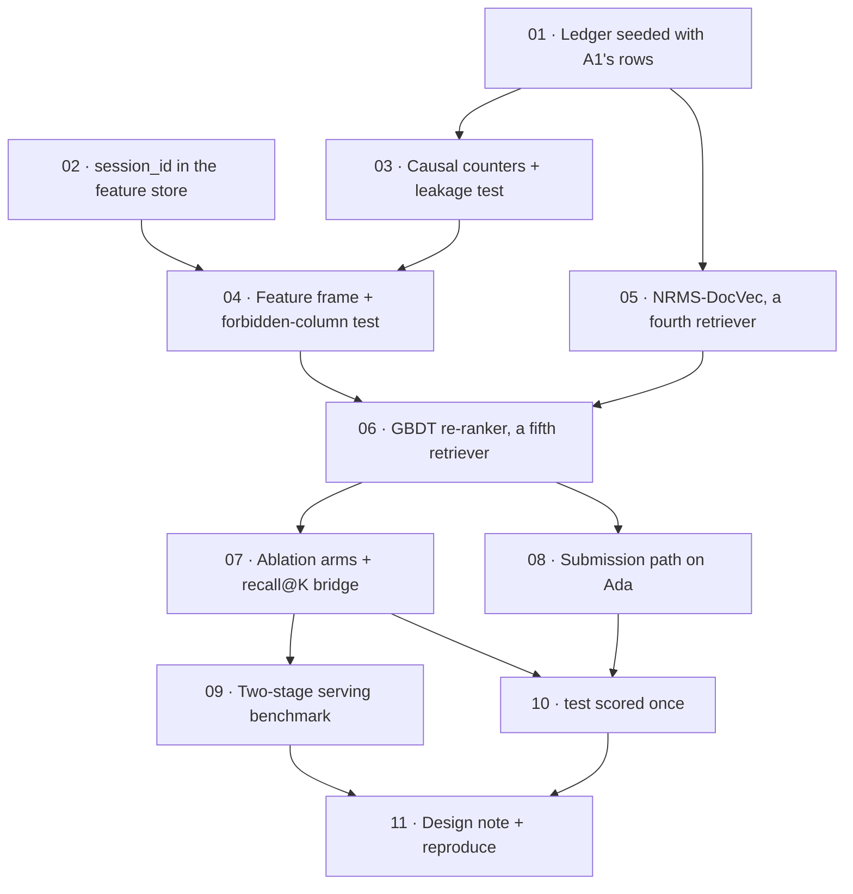

# Tickets — Assignment 2: Learning from Click-Logs

Eleven tickets breaking `../../NEW_PLAN.md` and `A2.pdf` into tracer-bullet slices, each sized to be
picked up cold and finished in one sitting. Each cuts a narrow but complete path — registry,
pipeline stage, harness, test — and is done when it is demoable on its own: a number in the ledger,
a file that scores, a test that fails when the guard it protects is removed.

The decisions these tickets implement were settled in the design interview recorded in
`NEW_PLAN.md`; do not re-litigate them here. Two rules carry over from A1 and bind every ticket:
**chosen on `tune`, reported on `validation`, `test` scored once**, and **no stage branches on a
dataset name** — every MIND/EB-NeRD difference lives in the registry.

## What is new in these tickets

Every ticket that tries an option writes a row to the **trade-off ledger** — functional metrics
(AUC, MRR, nDCG, diversity, novelty, coverage, with CIs) and engineering metrics (bytes, seconds,
peak RSS, p50/p99, rows/s) on the same row. The design note is written from that file, so a
ticket is not done while its row has one side blank.

## Dependency graph

**Frontier at the start:** 01 and 02. As soon as 01 lands, 05 runs in parallel with 03 → 04. That
parallelism is what makes five days enough.

## Budget

| by end of | tickets |
|---|---|
| Sept 16 | 01, 02, 03, 05 |
| Sept 17 | 04, 06 |
| Sept 18 | 07, 08 (jobs running) |
| Sept 19 | 09, 10 |
| Sept 20 | 11 |
